```{css, echo=FALSE}
.title-slide {
  background-image: url(assets/img_l3/git.png);
}
```
<!-- To add / change

add about VS Code and github 

  -->

```{r setup, include=FALSE}
knitr::opts_chunk$set(echo = FALSE)
library(magrittr)
```

# Learning expectations

This won't even touch the surface of git... But! Hopefully, you:

- Recognize the power of using version control

- Know the basic tools to get started using git

- Where to go for help

---

# Getting started
You need:

* RStudio or VS Code

* R

* a github account

* git software

* R packages:
  * `usethis`
  * `gitcreds`

```{r, echo = FALSE}
library(gitcreds)
library(usethis)
```
---

# Rings a bell?

.center[
```{r, out.height="500px"}
knitr::include_graphics("http://www.phdcomics.com/comics/archive/phd101212s.gif")
```
]

---

# Is your workflow...

.center[
```{r, out.height="500px"}
knitr::include_graphics("assets/img_l3/definitions.jpg")
```
]

---

# Why reproducible science?

.center[
```{r, out.height="600px"}
knitr::include_graphics("assets/img_l3/natureCapture.png")
```
]

---

# RStudio Projects

#### Use RStudio projects to keep materials associated with a particular analysis together

.pull-left[
- **Self contained** and **portable**

- **Working directory set to root** of project on launch

- **Fresh session** everytime the project is launched

See Jenny Bryan's post on [**project oriented workflows**](https://www.tidyverse.org/articles/2017/12/workflow-vs-script/) for more details
]

--

.pull-right.center[

**File > New Project > New Directory**

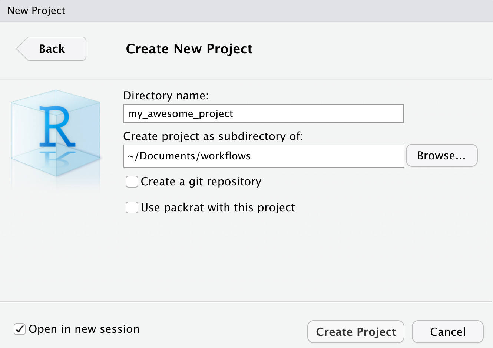
]


---

# Alternatives to RStudio Projects

### So You don't like `RStudio` `r emo::ji("broken_heart")`

--

.pull-left[
Essentially a **Rstudio Project**:

- organise all the files within a given project folder

- set project folder as *working directory*

- ensure a fresh, clean session
]

--

.pull-right[
#### simply, do the same without using RStudio `r emo::ji("star_struck")`
]

---

# Version Control

### What is it? `r emo::ji("thinking")`

The **management of changes** to documents, computer programs, large web sites and other collections of information.

--

### Git 

Open source (free to use) **Version control software.**

--

### GitHub 

A **website** (https://github.com/) that allows you to **store your Git repositories online** and makes it easy to collaborate with others.

---

# Getting started with Git and GitHub

1. Create an account on GitHub

  * You set your username, email and password here

--

2. install `git` on your computer

  * Windows: https://gitforwindows.org/

  * MacOS: need Xcode tools.
      * In a shell/terminal: `xcode-select --install`

  * Linux:
      * debian-based: `sudo apt install git`
      * Fedora, RedHat: `dnf install git`

--

3. You might need to restart you computer

For more details got to https://git-scm.com/downloads
---

# Git, Github & IDE

#### Before: git only through the terminal `r emo::ji("cry")`
***
--

#### Now: git can be used via multiple user-friendly interfaces

--
RStudio + `usethis` `r emo::ji("package")` + `gitcreds` `r emo::ji("package")` ==
`r emo::ji("heart")` `Git` & `GitHub` `r emo::ji("star_struck")`

--

When using VS Code

--

.center[

]


---

# Configure git & GitHub

**to be done only once**

## Configure git

**To check your configuration**

```{r, eval = FALSE, echo = TRUE}
usethis::git_sitrep()
```

--

**Set your configuration**

Use your github username and and the email you used to sign-up on GitHub

```{r, eval=FALSE, echo = TRUE}
usethis::use_git_config(
   user.name = "JulienGAMartin",
   user.email = "julien.martin@uottawa.ca")
```

---

# Configure GitHub authentication

### Get GITHUB Personal Authorisation Token

```{r, eval = FALSE, echo = TRUE}
usethis::create_github_token()
```
 Need scopes *repo, users, workflows* at least

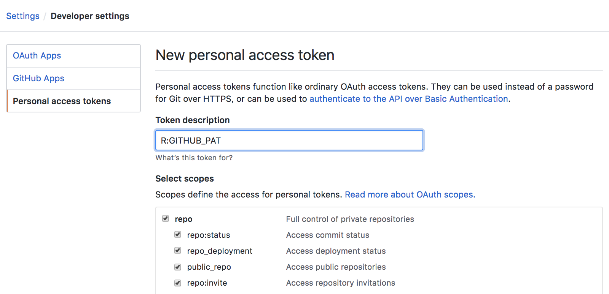

---

# Configure GitHub authentication
### Store your git token with credentials

```{r, eval = FALSE, echo = TRUE}
gitcreds::gitcreds_set()
```

Provide your github PAT token in the window

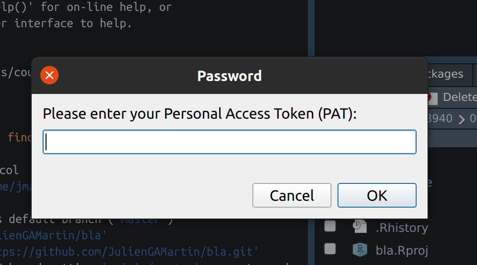

--

Restart RStudio and R

--

**Git and github access should be configured now**

---

# New project using GitHub and Rstudio

**Might be problematic the first time you do it**

1. create R project

2. initialise it for git
    ```{r, eval = FALSE, echo = TRUE}
    usethis::use_git()
    ```
3. Accept the commit and restart R

4. In R, to create github repo and link it
    ```{r, eval = FALSE, echo = TRUE}
    usethis::use_github()
    usethis::git_vaccinate()
    ```

5. Check on github that the repos is there

--

**et voila**

---

# New project using GitHub and NOT Rstudio

### Option 1

1. create new empty folder for your project(no space, no accent)

2. add at least one file in it (suggest README.md)

3. using terminal/shell
    ```{bash, eval = FALSE, echo = TRUE}
    git init
    git add .
    git commit -a -m "first commit"
    ```
4. In R, to create github repo and link it
    ```{r, eval = FALSE, echo = TRUE}
    usethis::use_github()
    usethis::git_vaccinate()
    ```
5. Check on github that the repos is there

--

**et voila**

---

# New project using GitHub and NOT Rstudio

### Option 2

1. Create new repository on `github`

2. Set R working directory where you want to save your project

3. To clone (and link) github repo to your computer
    ```{r, eval = FALSE, echo = TRUE}
    usethis::create_from_github(
      "https://github.com/your_github/your_repo.git",
      destdir=".")
    ```

4. Check that your folder has been created where you want it

--

**et voila**

---

# Git panel

## Integrated graphical user interface

<br>

.center[
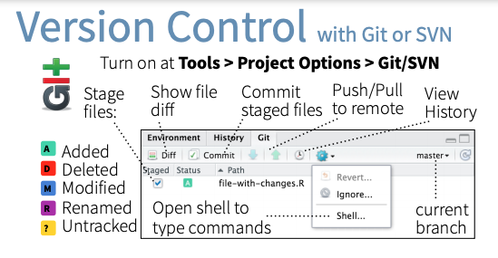
]


---

# Git terms

* **repository** your project folder

* **commit** a snapshot of your repo

* **push** send commits to a remote

* **pull** get commits from a remote


--

* **clone** get the repository from the remote for the first time

* **branch** a movable label that points to a commit

* **merge** combining two branches

* **remote** a computer or server with the repository on it

---

# Git RStudio workflow

.pull-left[
#### 1.view file status
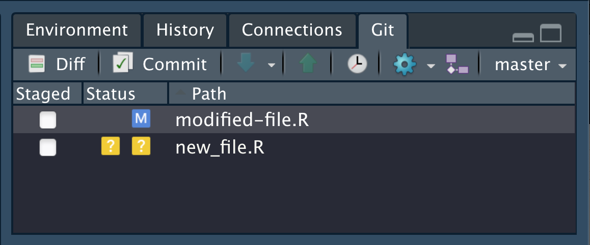


#### 2.stage files
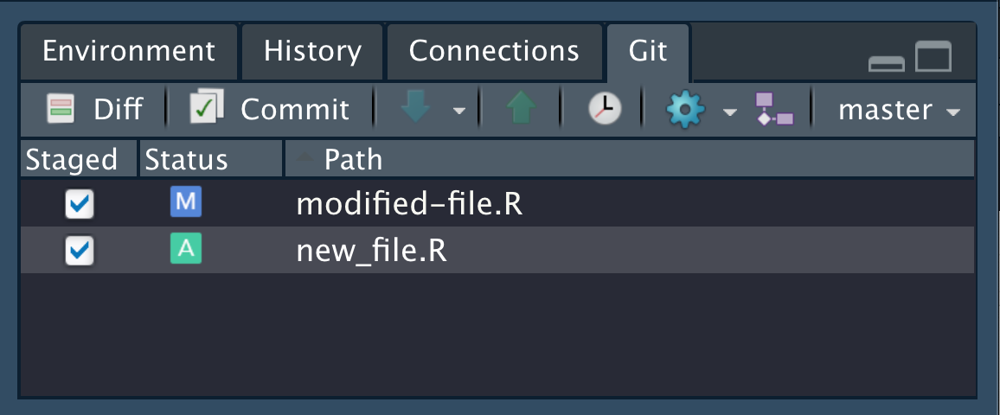
]


.pull-right[
#### 3.commit changes
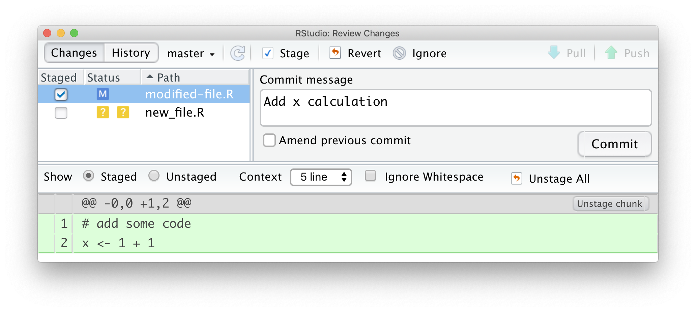
]

---

# Share on GitHub

#### Create repo

```{r, eval=FALSE}
usethis::use_github(protocol = "https")
```

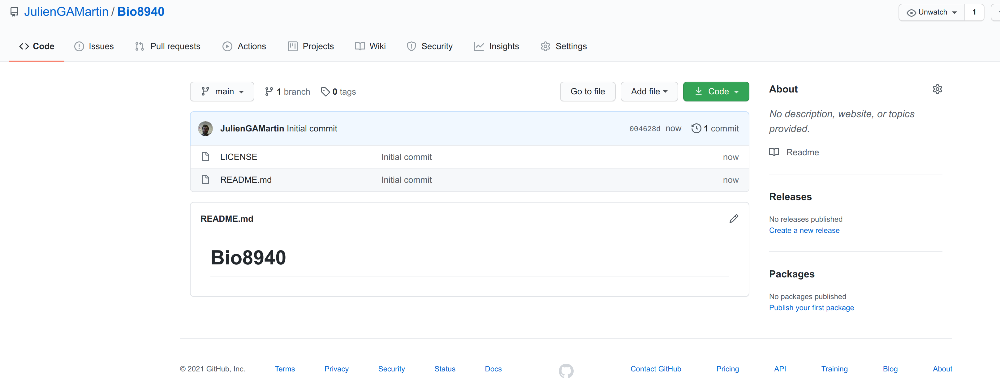

#### Push further changes

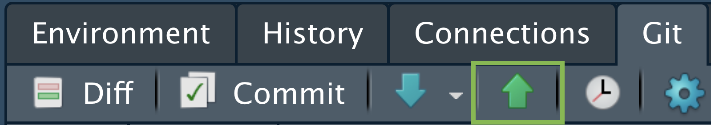


---

# Anatomy of a GitHub repo

- **`README`**. Explain what your project is, and how to use it.
  - `usethis::use_readme_md()`
  - `usethis::use_readme_rmd()`

--

- **`LICENSE`**. Without a licence, the contents of the repository are technically closed.
  - Examples licence [CC-by](https://creativecommons.org/licenses/by/4.0/): `usethis::use_ccby_license(name = "Julien Martin")`
  - `?licenses`: details of functions available to generate licenses
  - [https://choosealicense.com/](https://choosealicense.com/) help on choosing a licence.

--

- **`CONTRIBUTING.md`** - guidelines for contributors.
  - `usethis::use_tidy_contributing()` provides a realtively strict but instructive template


--

- **`CODE_OF_CONDUCT.md`** set the tone for discourse between contributors.
  - `use_code_of_conduct()`

---

# GitHub issues

### use GitHub issues to plan, record and discuss tasks.

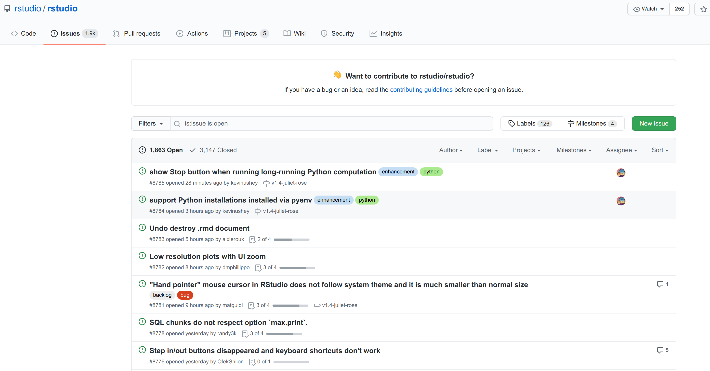

---

# Why using a remote like GitHub ?

* A backup of your repository (**Dropbox** is **NOT** a backup)

* Work with others (not covered)

* Increase your visibility

* Increase interactions with users

* Easy distribution of R packages (without CRAN submissions)

--

***
.center[
### one more time just in case

### **Dropbox** is **NOT** a backup
]

---
# Branching and merging

#### This the true Power of git

.center[

]

---
# Branching and merging

.pull-left[
#### Branching in Rstudio
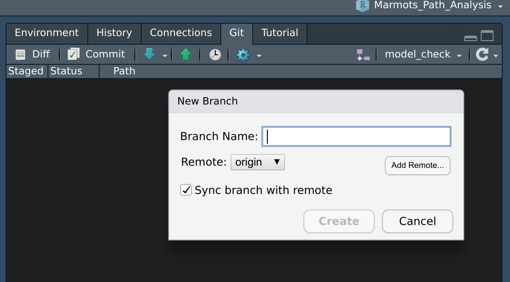
]

--

.pull-right[
#### Pull request in Github

When you want to merge branches:

* create a pull request on Github

* check for incompatibilities

* then merge

]

---

# Resources

<br>

#### I used many slides from [Olivier Gimenez] (https://oliviergimenez.github.io)

<br>

#### Check out [Happy Git and GitHub for the useR](https://happygitwithr.com/) for more joy with `git`

<br>

#### The British Ecological Society has [A Guide to Reproducible Code in Ecology and Evolution](https://colauttilab.github.io/Readings/BES-Reproducible-Code.pdf)

---

# Virtuous research cycle

.center[

]
